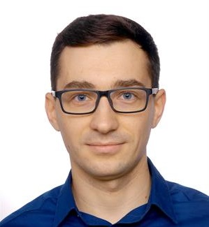

# Michał Bałdyga - my first website

## Demo
https://q270311.github.io/homepage/
## Description 
This is my first website written during the _Frontend Developer od podstaw_ course at YouCode. I wrote a few words about me: 
my education, work experience and my hobby.
After the first lesson:
- I wrote an "about me" page, using html markup.
- I checked the correctness of the code, in the html validator
- I added a css file to my page - set the font, background of elements using the class
- I added a js file to my page - clicking the button shows the answer to the question question.

## Languages
 - HTML
 - CSS
 - JavaScript